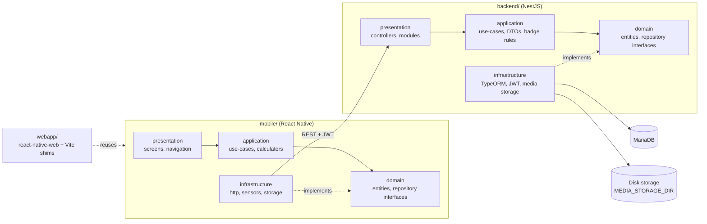

# havefun-courses

> A mobile app that helps middle and high-school students apply maths, physics, chemistry and biology concepts to the passions they already have, through concrete field challenges — aligned with UN SDG 4 (Quality Education).

<!-- TODO Vincent : add a 10 s GIF or screenshot of a mission screen (or of the local web demo). -->

**Status:** <!-- TODO Vincent : confirm status (active | stable | archived). Last commits: Sept 2026. --> — **License:** MIT

---

## 1. Why this project exists

- **Problem:** school theory feels disconnected from real life. Students rarely see where a formula is used in the things they care about (mechanics, drawing, music, skateboarding).
- **Who it's for:** middle and high-school students, and teachers who want field-based activities. Usage guides are in French: [`docs/guide-utilisateur.md`](docs/guide-utilisateur.md).
- **Intent:** the student picks a class level and passions, takes a challenge ("Quête") from a catalogue filtered by interests, and learns the concept through a narrative situation followed by a field calculator. Proof of the work (annotated photo, sensor measurement) is submitted and validated, which unlocks experience, trade badges and a SDG 4 "Pass Compétences" exportable as a PDF.

The pedagogical content is a programme of **69 missions** (maths, physics, chemistry, SVT) that start from a dated historical problem, then have the student replay the experiment outdoors (guided) and solve a second problem alone. See [`docs/college-attendus/programme-histoire-des-sciences/`](docs/college-attendus/programme-histoire-des-sciences/README.md) (in French).

## 2. Architecture & technical choices

Two decoupled applications in one repository, `mobile/` and `backend/`, talking only through a REST API authenticated with JWT. Each side applies the same four-layer Clean Architecture and owns its domain layer. The `webapp/` reuses the mobile code in a browser for demos.



| Decision | Why | Alternative considered |
|---|---|---|
| Clean Architecture + SOLID on mobile and backend ([`docs/architecture.md`](docs/architecture.md)) | `domain/` is testable without DB, network or React Native; dependencies are injected through interfaces | — <!-- TODO Vincent : alternative not stated in the docs --> |
| React Native (TypeScript) for mobile | Same language ecosystem as the NestJS backend; mature libraries for camera, sensors, local storage | Flutter: solid, but a second language (Dart) without a decisive MVP benefit |
| NestJS, REST, JWT | Modules and providers map naturally to Clean Architecture; the MVP API surface is CRUD plus a few business actions; stateless auth fits multi-device mobile | GraphQL (extra tooling for little gain) |
| MariaDB with TypeORM migrations | Strongly related entities (user, passion, challenge, submission, badge) need referential integrity; hosting cost and operational simplicity | PostgreSQL: equivalent robustness for this scope |
| Media proofs on the backend's disk (commit `0d515ec`) | Simpler to run locally and to deploy | S3-compatible storage with MinIO: the original plan in `docs/architecture.md`, replaced by commit `0d515ec` |
| Field calculators as pure functions in `mobile/src/application/calculators/`, each with its own test | A mission's calculation is independent of the UI and unit-testable | <!-- TODO Vincent : alternative considered, not documented --> |
| Web demo that reuses mobile code through `react-native-web` and thin shims ([`webapp/README.md`](webapp/README.md)) | One codebase for a no-install browser demo; only native modules are swapped for web shims | A separate web front-end (duplicated screens) |
| `AUTH_DISABLED=1` local demo mode, guarded in `jwt-auth.guard.ts` | Demo without a login screen; must never be enabled in production | — |

**Stack:** React Native 0.87 (TypeScript), NestJS, TypeORM, MariaDB, Passport JWT, Swagger (served on `/docs`), pdfkit (Pass Compétences PDF), Vitest (backend), Jest (mobile), oxlint / ESLint.

**Repository layout:**
```
backend/src/
  domain/          # entities, repository interfaces
  application/     # use-cases (auth, challenges, media, passions, users), DTOs, gamification/badge-rules
  infrastructure/  # auth (JWT), persistence (TypeORM, migrations, seeds), storage
  presentation/    # controllers, NestJS modules
mobile/src/
  domain/          # entities, repository interfaces
  application/     # use-cases, calculators
  infrastructure/  # http, sensors, storage
  presentation/    # screens (incl. mission validators), navigation, components, theme
webapp/            # browser demo (react-native-web, no authentication)
docs/              # architecture, design system, deployment, GDPR/accessibility, guides
```

**Quality:** unit tests on both sides (22 backend tests with Vitest, 197 mobile tests with Jest), an e2e spec in `backend/test/`, and two path-filtered GitHub Actions workflows ([backend](.github/workflows/backend.yml): lint, build, test; [mobile](.github/workflows/mobile.yml): typecheck, lint, test).

More: [`docs/architecture.md`](docs/architecture.md), [`docs/design-system.md`](docs/design-system.md), [`docs/deployment.md`](docs/deployment.md), [`docs/rgpd-accessibilite.md`](docs/rgpd-accessibilite.md). The interactive Swagger API documentation is served on `/docs` by the running API.

## 3. Quickstart

**Prerequisites:** Node.js 20+ (CI uses 20), npm 10+, MariaDB 10.x (local or container), Xcode (iOS) and/or Android Studio (Android).

Backend, with a local MariaDB container if you have none (`podman` works in place of `docker`):

```bash
docker run -d --name havefun-mariadb \
  -e MARIADB_DATABASE=havefun_courses \
  -e MARIADB_USER=havefun \
  -e MARIADB_PASSWORD=changeme \
  -e MARIADB_ROOT_PASSWORD=changeme \
  -p 3306:3306 \
  mariadb:10.11

git clone https://github.com/vincent-agi/havefun-courses.git
cd havefun-courses/backend
npm install
cp .env.example .env      # set the MariaDB access and the JWT secret (never commit .env)
npm run migration:run
npm run seed              # optional: demo dataset
npm run start:dev
npm test                  # Vitest unit tests
```

Mobile:

```bash
cd mobile
npm install
npm run ios      # or: npm run android
npm test         # Jest
```

Browser demo, with the backend started as `AUTH_DISABLED=1 npm run start:dev` (local demo only):

```bash
cd webapp
npm install
npm run dev      # http://localhost:5173
```

Guides (in French): [install and run the mobile app](docs/guide-installation-mobile.md), [use an iPhone with a MacBook's local database](docs/guide-reseau-local-ios.md), [user guide](docs/guide-utilisateur.md).

## 4. Lessons learned

<!-- TODO Vincent : these are leads inferred from the code, docs and git history. Rewrite in your own voice or delete. -->

- **What this project validated:** <!-- TODO Vincent : lead — Clean Architecture on both sides let the 69-mission programme grow (calculators, validators, seeds) without touching the layering; the web demo reuses mobile code almost as-is. -->
- **What was harder than expected:** <!-- TODO Vincent : lead — turning the pedagogical programme (69 issues in 4 subjects) into seeded data and field calculators, with the experimental flow rolled out progressively (commits 09eafae, a6513b1). -->
- **What I'd do differently today:** <!-- TODO Vincent : lead — the original S3/MinIO plan was dropped for disk storage (0d515ec); the architecture doc still describes S3/MinIO and mentions Prisma and per-domain modules that differ from the code. -->
- **Next steps / roadmap:** <!-- TODO Vincent : lead — `docs/architecture.md` mentions a future multi-establishment model, not implemented at the MVP. Choose a license. -->

---

## Contributing

Issues and PRs welcome, see [`CONTRIBUTING.md`](CONTRIBUTING.md) (trunk-based workflow, Conventional Commits).

## About

Built by [Vincent AGI](https://vincent-agi.fr) — software engineer & mentor.
